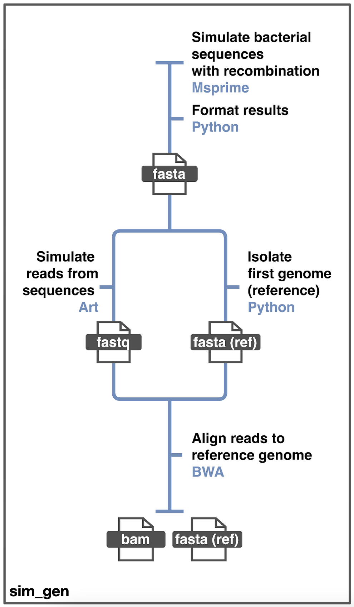

<h1 align="center">Rhometa_sim - Metagenomic Read Simulation Pipeline</h1>
  <p align="center">
    Metagenomic read simulation pipeline with recombination and mutation

- [About](#about)
  - [Built With](#built-with)
- [Getting Started](#getting-started)
  - [Requirements](#requirements)
  - [Set up using conda](#set-up-using-conda)
  - [Set up using docker](#set-up-using-docker)
- [Rhometa_sim pipeline](#rhometa_sim-pipeline)
- [Quick Start and Output](#quick-start-and-output)
    - [Paired end reads](#paired-end-reads)
    - [Single end reads](#single-end-reads)
- [Pipeline Options](#pipeline-options)
- [Issues and Contributing](#issues-and-contributing)
- [License](#license)
- [Contact](#contact)


<!-- ABOUT -->
## About
Shotgun metagenomic read and reference genome simulator based on msprime. Designed to simulate reads with mutation and gene conversion type recombination. Originally designed to generate simualated datasets to help test metagenomic population recombination rate estimation pipeline rhometa, hence the name rhometa_sim.

### Built With

* [Nextflow](https://www.nextflow.io/)
* [Msprime](https://tskit.dev/msprime/docs/stable/intro.html)
* [ART read simulator](https://www.niehs.nih.gov/research/resources/software/biostatistics/art/index.cfm)


<!-- GETTING STARTED -->
## Getting Started

Rhometa_sim is designed to be run on linux and requires nextflow to be installed. 
Dependencies are resolved either via conda or docker images. Support for HPC, docker, singularity, AWS and many other systems are provided via nextflow.

While it is possible to resolve the dependencies using conda for running on macOS, its recommended that this option be used on linux systems for which it has been extensively test.
If running on macOS it recommended that docker be used with the provided image, in which case it is similar to running in a linux environment.

It is also possible to install and run the program on Windows via [wsl](https://docs.microsoft.com/en-us/windows/wsl/install).

### Requirements
* Nextflow: [Nextflow install](https://www.nextflow.io/index.html#GetStarted) 
  * Installing nextflow via conda is recommended, since with conda other dependencies can also be resolved.
* Conda or containerization platform
  * If using conda, the conda package manager available from: [Miniconda download](https://conda.io/en/latest/miniconda.html).
  * If using containers, docker is recommended and is available from: [Docker download](https://www.docker.com/get-started).
    * The required docker image can be found at https://hub.docker.com/repository/docker/sidkris/rhometa_sim.
    * It is not required that the user download the image, the program has been pre-configured to use this image, provided docker is 
    installed and the docker option is enabled.
  * Other container technologies such as singularity (used for HPCs) are also supported via nextflow.

### Set up using conda
Instructions for installing nextflow and dependencies via conda
1. Clone the repo
   ```sh
   git clone https://github.com/sid-krish/rhometa_sim.git
   ```
2. Install the conda package manager: [Miniconda download](https://conda.io/en/latest/miniconda.html)
3. Install nextflow
   ```sh
   conda install -c bioconda nextflow
   ```
4. Adjust settings in nextflow.config file, by default it is configured to work with docker with modest resources.
   Disable the use of docker by setting the docker option to false. Disabling the use of container engines will cause conda packages to be used by default:
   ```sh
   docker {
       enabled = false
   }
   ```
5. The pipeline is now ready to run, and all dependencies will be automatically resolved with conda.

### Set up using docker
Instructions for installing nextflow and using the provided docker image for dependencies
1. Clone the repo
   ```sh
    git clone https://github.com/sid-krish/rhometa_sim.git
   ```
2. Install nextflow [Nextflow install](https://www.nextflow.io/index.html#GetStarted)
3. Install docker desktop [Docker install](https://docs.docker.com/desktop/linux/).
4. Adjust settings in nextflow.config file, by default it is configured to work with docker with modest resources.
5. In the sim_gen.nf file comment the lines related to conda, for instance:
   ```
   // conda 'conda-forge::msprime=1.1.1 conda-forge::gsl'
   ```
6. Ensure docker is running.
7. The pipeline is now ready to run, all the required dependencies are present in the docker image, that the pipeline is preconfigured to use.


<!-- RHOMETA_SIM PIPELINE -->
## Rhometa_sim pipeline


General nextflow help can be accessed with: 
   ```sh
    nextflow -help
   ```

Pipeline specific help can be accessed with:
   ```sh
    nextflow sim_gen.nf --help
   ```

The pipeline specific help also provides instructions on how to run it and the parameter options.


<!-- QUICK START AND OUTPUT -->
## Quick Start and Output
The pipeline is preconfigured to generate 2 small bam and reference datasets for testing purposes. This following section shows how to generate them.

The 2 datasets can be generated with single end or paried end reads. Both these options will be covered.

#### Paired end reads
```sh
nextflow run sim_gen.nf
```

#### Single end reads
```sh
nextflow run sim_gen.nf --single_end
```

By default, running the command will output the files to 'Sim_Gen_Output' this can be changed with the option --output_dir with the folder name.

In both the single end and paired end case, 4 files will be generated. 2 bam files and 2 fasta reference files corresponding to the simulation parameters. The simulation parameters are reflected in the filenames. Note the recomibation and mutation rates are the unscaled values. This will be discussed further in the pipeline options section.


<!-- PIPELINE OPTIONS-->
## Pipeline Options
In general pipeline specific options are activated using "--option_name", options specific to nextflow are activate with "-option_name". 

The options specific to the pipeline can be viewed using "nexflow run sim_gen.nf --help", where as to access nextflow help the command is "nextflow -help".

The following are the options available for sim_gen.nf:
```
Usage:
nextflow run sim_gen.nf [options]

Help:
nextflow run sim_gen.nf --help

Options:
--tract_len [int], default:[1000], Recombination tract length to use
--single_end, Used for single end read bams
--read_len [int], default:[150], Read length of each individual read
--paired_end_mean_frag_len [int], default:[300], The mean size of DNA fragments for paired-end simulations 
--paired_end_std_dev [int], default:[25], The standard deviation of DNA fragment size for paired-end simulations 
--seed [int], default:[123], Seed value to use for simulation
--mutation_rates [int], default:[0.005], Unscaled mutation rate. This value is scaled as such: 2 * ploidy (1) * effective_population_size (1) * unscaled_mutation_rate
--recom_rates [int], default:[0.005, 0.01], Unscaled recombination rate. This value is scaled as such: 2 * ploidy (1) * effective_population_size (1) * unscaled_recombination_rate * tract_length
--sample_sizes [int], default:[20], Number of haplotypes to use for generating reads
--genome_sizes [int], default:[50000], Genome size of haplotypes
--fold_cov [int], default:[4], The fold of read coverage to be simulated or number of reads/read pairs generated for each haplotype genome
--output_dir [str], default:[Sim_Gen_Output], Directory to save results in
```

It is important to note that the recom_rates and mutation_rates inputs are unscaled values, the final simulated values will be the scaled values following the formulation shown in the help/options above.

Additionaly, in the sim_gen.nf script where the input to options are in the form of a list, multiple values can be provided, for instance:

```
params.recom_rates = [0.005, 0.01]
```


<!-- ISSUES AND CONTRIBUTING -->
## Issues and Contributing
If you have any issues please open an issue with the details and steps for reproducing the issue. If you have any questions please open a issue with the tag "question" or alternatively email one of the authors from the contact section.

If you have a suggestion that would make this better, please fork the repo and create a pull request. You can also simply open an issue with the tag "enhancement".


<!-- LICENSE -->
## License
Distributed under the MIT License. See `LICENSE.txt` for more information.


<!-- CONTACT -->
## Contact
Sid Krishnan - sidaswar.krishnan-1@student.uts.edu.au, sid.kr15n@gmail.com \
Aaron Darling - aaron.darling@uts.edu.au \
Matt DeMaere - matthew.demaere@uts.edu.au